🍲 BendenMutfağınıza - Restoran Sipariş ve Yapay Zeka Destekli Mobil Uygulama 

**BendenMutfağınıza**, kullanıcıların restoranda fiziksel olarak bulunduklarında mobil cihazları üzerinden **sipariş verebilmesini** sağlayan bir uygulamadır.  
Sistem, arka planda çalışan RESTful API'ler ve **SignalR ile gerçek zamanlı bağlantı** kullanılarak web uygulamasıyla senkronize şekilde çalışır.

---

## 🚀 Özellikler

- 🪑 **Masa Seçimi:** Kullanıcılar boş masayı seçip oturum başlatabilir
- ⛔ **Dolu Masa Engeli:** Bir masaya sadece bir kullanıcı sipariş verebilir
- 🍽️ **Menüden Sipariş Verme:** Kullanıcılar menüdeki ürünleri görüntüleyip sipariş oluşturabilir
- 🔄 **Gerçek Zamanlı Güncellenme:** Masa ve sipariş durumu SignalR ile canlı olarak yansıtılır
- 🔒 **Rezervasyon Oluşturma:** Kullanıcılar önceden masa rezervasyonu yapabilir
- 🧂 **Yapay Zeka Özelliği:**
  - 👩‍⚕️ Yemeğin kalorisini tahmin eder
  - 🍅 Yemeğin içerik malzemelerini listeler
- 💬 **Yorum Ekleme:** Kullanıcılar yedikleri yemeklerle ilgili yorum bırakabilir

---

## 🔌 Teknolojik Altyapı

- **Mobil İstemci:** Flutter / React Native / (sen hangi teknolojiyle yaptıysan onu yaz)
- **Backend:** ASP.NET Core Web API
- **Gerçek Zamanlı:** SignalR ile masa/sipariş senkronizasyonu
- **Veri Tabanı:** SQL Server / SQLite
- **Yapay Zeka:** Özel modelle entegre AI servisleri (kalori & içerik analizi)

---

## 📸 Ekran Görüntüleri 

### 🏠 Ana Sayfa
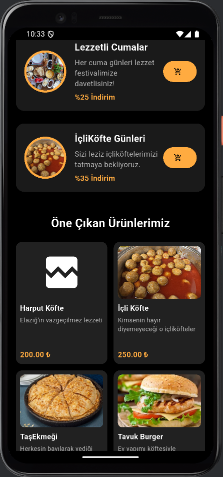
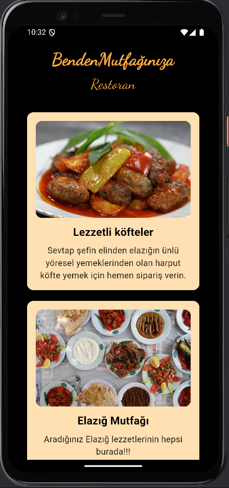
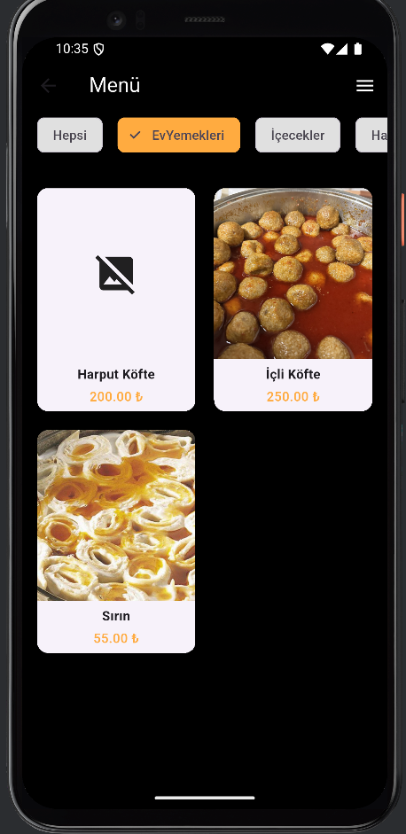  
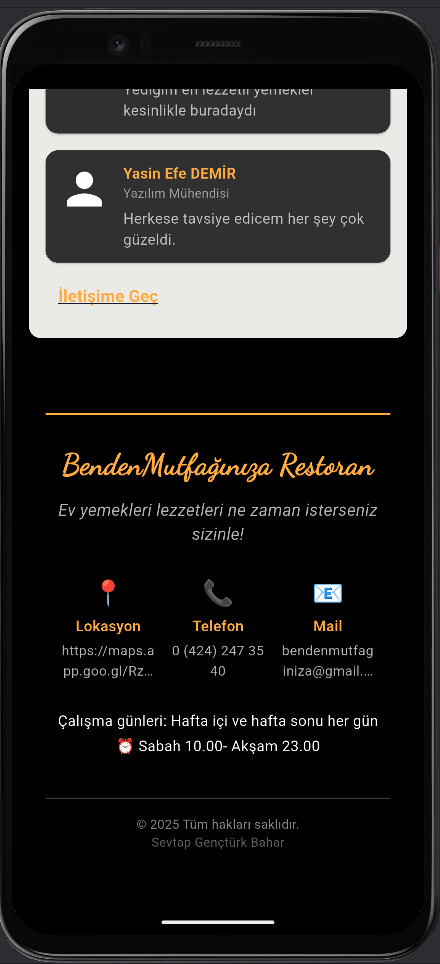

### 🪑 Masa Seçimi
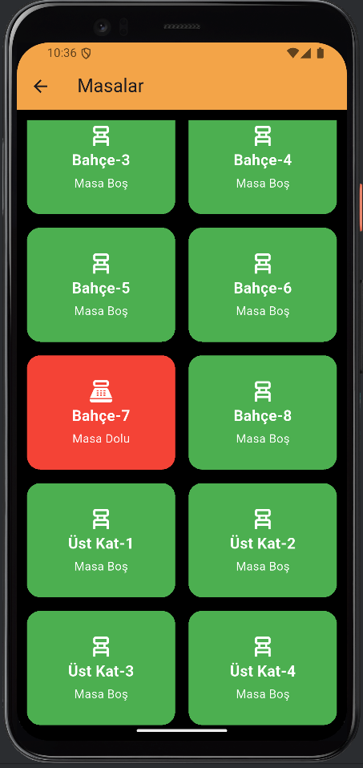

### 🍽️ Menü ve Sipariş
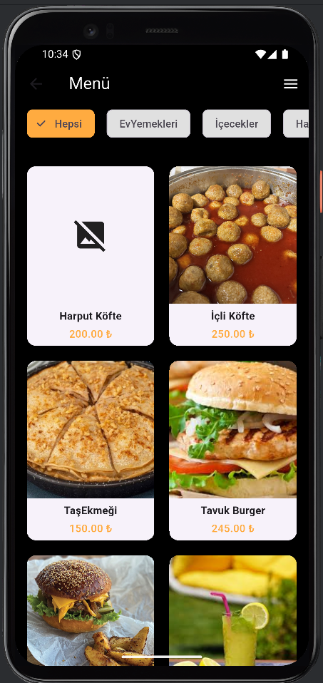  
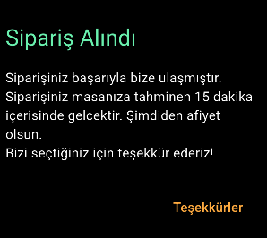

### 🧠 Yapay Zeka Özellikleri
- **Kalori Tahmini**
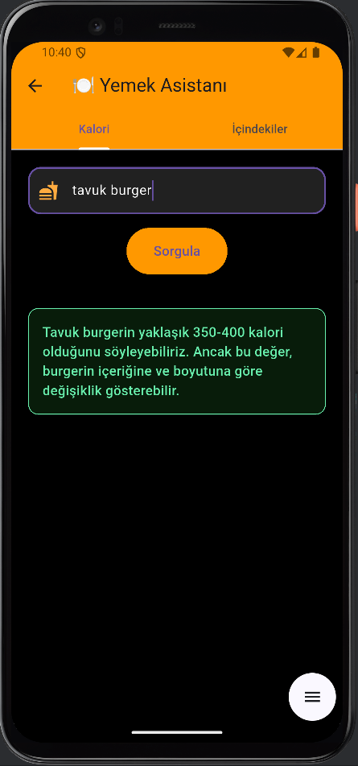

- **İçerik Analizi**
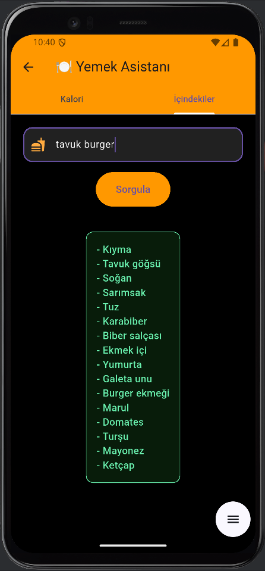

### 📅 Rezervasyon
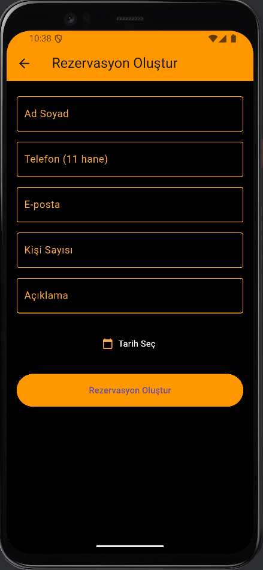

### 📝 Hakkımızda ve Yorumlar
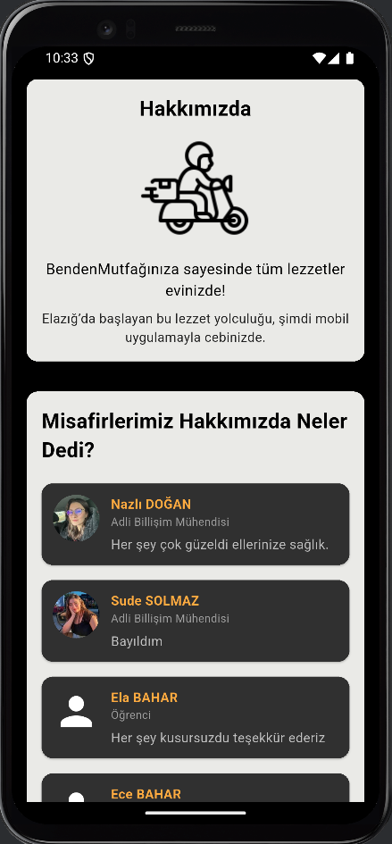

### 📬 Bize Ulaşın
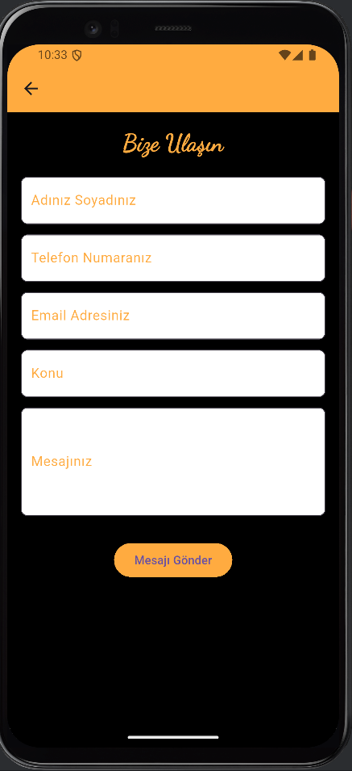

---

## ⚠️ Not

Bu mobil uygulama sadece müşteri tarafını kapsar. Yönetim paneli web sürümüne özeldir.

---

📌 *Bu proje, geleneksel restoran deneyimini dijitalleştiren mobil odaklı bir kullanıcı uygulamasıdır.*
